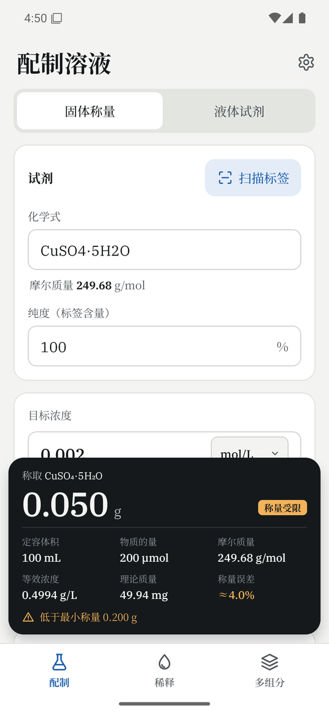
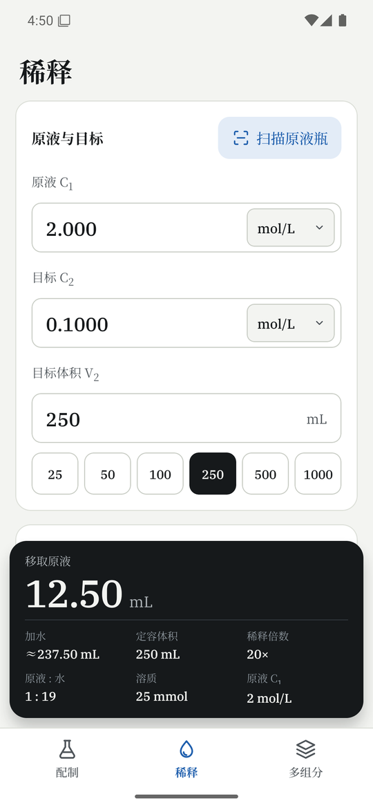
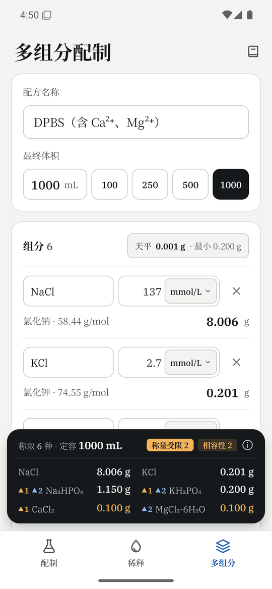
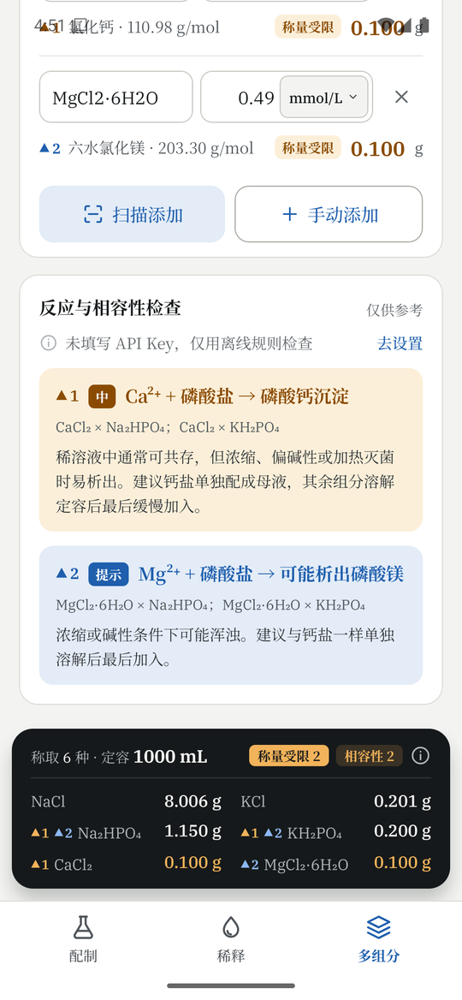
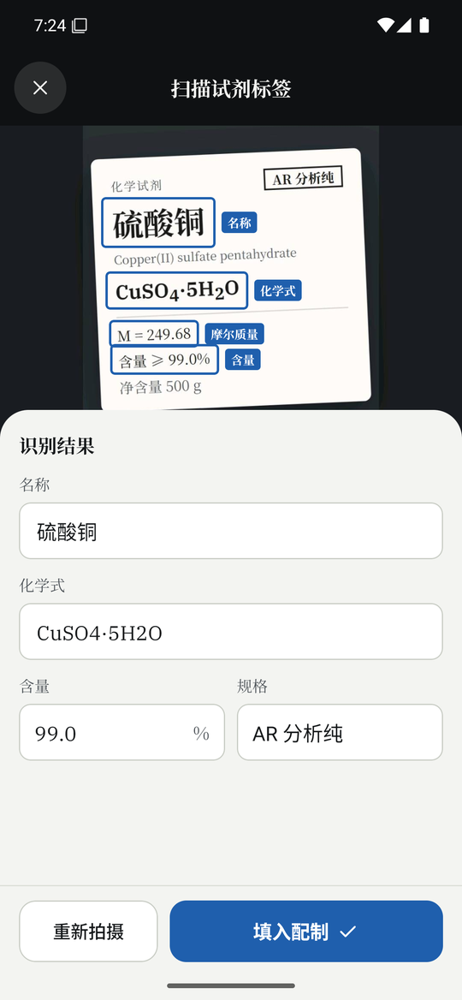
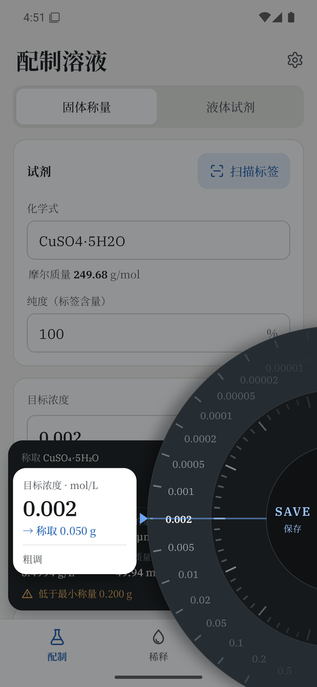
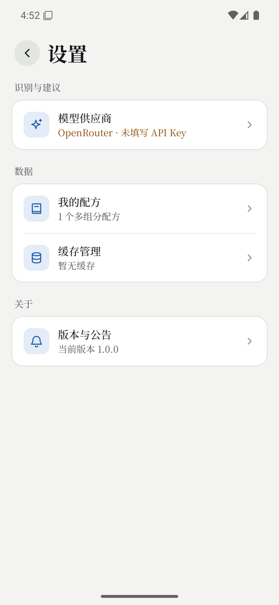

<div align="center">


# 配液计算器

**实验室配液的口袋助手：称量、稀释、多组分配方，一步算清。**
<br />
拍一下试剂标签，名称、含量、密度自动填好；断网也能用。

[](https://github.com/AstreoX/solution-calculator/releases)
[](https://doc.dcloud.net.cn/uni-app-x/)
[](LICENSE)
[](https://github.com/AstreoX/solution-calculator/releases)

[下载安装包](https://github.com/AstreoX/solution-calculator/releases) ·
[功能](#功能) ·
[配置识别模型](#配置识别模型) ·
[本地开发](#本地开发) ·
[发版与公告](tools/release/README.md)

</div>

<br />

<table align="center">
  <tr>
    <td align="center"></td>
    <td align="center"></td>
    <td align="center"></td>
    <td align="center"></td>
  </tr>
  <tr>
    <td align="center"><sub><b>配制溶液</b><br />称量、纯度修正、最小称量提示</sub></td>
    <td align="center"><sub><b>稀释</b><br />移液量、加水量、稀释倍数</sub></td>
    <td align="center"><sub><b>多组分配制</b><br />一次算出每个组分的称量</sub></td>
    <td align="center"><sub><b>相容性检查</b><br />沉淀、放出有毒气体等风险</sub></td>
  </tr>
  <tr>
    <td align="center"></td>
    <td align="center"></td>
    <td align="center"></td>
    <td></td>
  </tr>
  <tr>
    <td align="center"><sub><b>扫描试剂标签</b><br />识别字段并在照片上标注</sub></td>
    <td align="center"><sub><b>长按旋钮</b><br />精细调节，移入 SAVE 保存</sub></td>
    <td align="center"><sub><b>设置</b><br />模型、配方、缓存、更新</sub></td>
    <td></td>
  </tr>
</table>

## 功能

### 🧪 配制溶液
- **固体称量**：按目标浓度和定容体积算出应称质量，自动按纯度（标签含量）修正；结晶水合物（如 `CuSO4·5H2O`）按完整化学式计算。
- **液体试剂**：用质量分数和密度折算原液浓度，再算出量取体积。标签上没有密度时，按内置的「质量分数—密度」表插值。
- **称量提醒**：结合天平精度给出最小称量和称量误差，低于最小称量时提示。

### 💧 稀释
C₁V₁ = C₂V₂，给出移取原液体积、加水量、稀释倍数和原液与水的比例，支持多种浓度单位之间换算。

### 🧫 多组分配制
- 一次输入多个组分和最终体积，逐个算出称量，并汇总到底部结果卡。
- **反应与相容性检查**：离线规则库识别常见风险，按严重程度标注到对应组分上：难溶沉淀（如钙盐与磷酸盐）、酸与碳酸盐 / 次氯酸盐 / 硫化物等反应放出气体、强碱与铵盐放出氨气、强氧化剂与盐酸生成氯气等。配置了模型后，还会结合浓度做 AI 复核（仅供参考）。
- **我的配方**：保存、载入、删除常用配方，比如 PBS、DPBS。

### 📷 扫描试剂标签
拍照或从相册选图，由视觉模型读出名称、化学式、分子量、含量、质量分数范围、密度、规格，自动填进表单，并在照片上框出每个字段的位置。

### 🎛️ 长按旋钮
长按任意数值框唤出旋钮：拖动快速调节，移入 SAVE 区域保存，适合单手微调。

### 📴 离线优先
- 内置约 **7.3 万**条化合物，其中约 1.8 万条有中文名；**23.5 万**个检索键，涵盖中英文名、俗名（胆矾、烧碱、海波……）和 CAS 号。化学式输入框也能直接输入名称。
- 另有 **491** 种人工核对的常用试剂，其中 80 种液体试剂带标签质量分数和密度；还有 20 张「质量分数—密度」表。
- 离线库查不到时联网查询 PubChem / Wikidata，结果缓存在本机，之后离线也能用。缓存可以在设置里查看、调整和清除。

### 🔔 应用内更新与公告
App 启动时读取本仓库的 [`update.json`](tools/release/README.md)：有新版本就在应用内下载安装，有公告就弹出或放进「设置 → 版本与公告」。不需要任何服务器。

## 下载安装

到 [Releases](https://github.com/AstreoX/solution-calculator/releases) 下载最新的 `chemcalc-<版本>.apk`。

- 支持 Android 5.0 及以上的 64 位（arm64）手机。
- 之后的版本会在 App 内提示更新。第一次在应用内安装时，系统会要求允许「安装未知应用」。

## 配置识别模型

标签扫描和 AI 复核需要一个视觉模型，计算功能不需要。配置方法：

1. 首页右上角齿轮 → **模型供应商**。
2. 选择供应商：OpenRouter、DeepSeek、硅基流动、通义千问、智谱，或自定义任意 OpenAI 兼容接口。
3. 填入 API Key。点模型框右侧的「选择」可以获取供应商的模型列表；OpenRouter 会标出支持图片的模型。
4. 点「测试连接」确认可用，然后保存。

推荐使用 **DeepSeek V4.1 Flash**，识别快、费用低。它在各平台上的模型名：

| 平台 | 模型名 |
|---|---|
| OpenRouter | `deepseek/deepseek-v4.1-flash` |
| DeepSeek 官方 | `deepseek-flash` |
| 硅基流动 | `deepseek-ai/DeepSeek-V4.1-Flash` |

> API Key 只保存在你的手机上。识别时照片会上传给你选择的供应商，AI 复核会发送配方的组分与浓度。

## 本地开发

**环境**：[HBuilderX](https://www.dcloud.io/hbuilderx.html) 5.24 或更高版本；一台安卓手机或模拟器。

1. 在 HBuilderX 中导入 `CC-uni-app-x/` 目录。
2. 选择「运行 → 运行到手机或模拟器」。
3. 打包：「发行 → 原生 App-云打包」。继续发版时，证书要和已发布的版本保持一致。

常用配置都在 [`CC-uni-app-x/common/config.uts`](CC-uni-app-x/common/config.uts)：

| 配置 | 作用 |
|---|---|
| `DEMO` | 设为 `true` 时载入设计稿里的示例数据，用于和设计稿对照。正式包必须是 `false` |
| `UPDATE_SOURCES` | 读取 `update.json` 的地址，按顺序尝试 |
| `LLM` / `OCR` | 设置页没填 Key 时的备用接入方式（任意 OpenAI 兼容接口、百度 OCR、自建 OCR 服务） |

### 项目结构

```
.
├── CC-uni-app-x/              # App 源码（uni-app x）
│   ├── pages/                 # 主页（三个面板）与设置页
│   ├── components/            # 配制 / 稀释 / 多组分面板、扫描、旋钮、弹窗等
│   ├── common/                # 计算、离线库、联网查询、识别、更新、配方、缓存……
│   └── static/                # 字体子集、离线化合物库、图标、App 图标
├── tools/
│   ├── db/                    # 离线化合物库的抓取与构建（数据来源见 SOURCES.md）
│   ├── fonts/                 # 字体子集构建
│   ├── icons/                 # 图标生成
│   ├── ocr/                   # 可选：基于 RapidOCR 的自建识别服务
│   └── release/               # 发版与公告工具（make_update.py）
├── skills/                    # 发版 / 公告流程手册（本地 skill，不会自动加载）
└── docs/screenshots/          # README 截图
```

### 工具脚本

```bash
python tools/db/build_db.py          # 重建离线化合物库（先运行 fetch_wikidata.py 抓取原始数据）
python tools/db/test_db.py           # 离线库自检
python tools/icons/build_icons.py    # 重新生成图标
python tools/ocr/ocr_server.py       # 启动自建 OCR 服务（可选）
```

字体子集已经生成好，放在仓库里。`tools/fonts/build_fonts.py` 重新构建时需要读取界面设计稿来统计用到的字符，而设计稿没有公开，所以一般不需要重建字体。

## 发版与公告

发版就是：打包 → 用脚本生成 `update.json` → 把安装包传到 GitHub Release → 推送 `update.json`。发公告只需要改 `update.json` 并推送。

详细步骤见 [tools/release/README.md](tools/release/README.md)，完整流程手册见 [skills/solution-calculator-release](skills/solution-calculator-release/SKILL.md)。

## 免责声明

计算结果和相容性提示仅供参考，不能替代试剂标签、安全技术说明书（SDS）和实验室的操作规程。配制前请核对化学式、纯度和浓度单位。

## 许可证

本项目代码以 [MIT](LICENSE) 许可证发布。内置字体（SIL OFL 1.1）、图标、化合物数据的来源与许可见 [THIRD_PARTY_NOTICES.md](THIRD_PARTY_NOTICES.md)。
